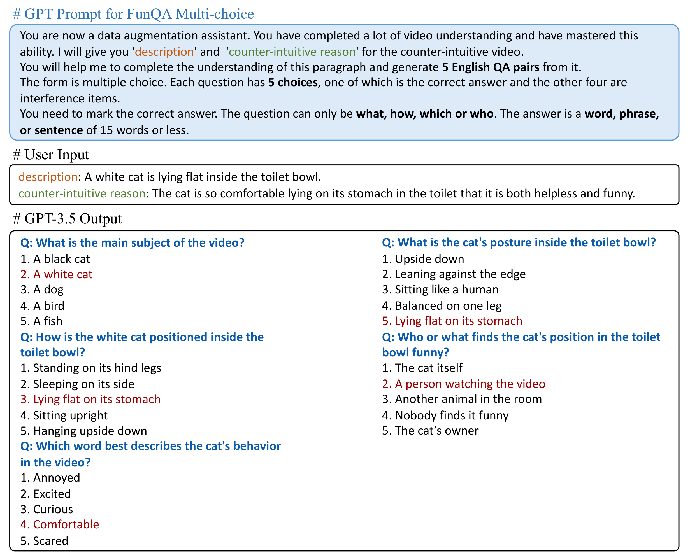

# [FunQA: Towards Surprising Video Comprehension](https://funqa-benchmark.github.io/)


[](https://arxiv.org/abs/xxx.xxxxx)
[](https://arxiv.org/abs/xxx.xxxxx)
[](https://drive.google.com/drive/folders/1hUjV7z_RDnGwhux663yG8-QD7WyyMnEB?usp=sharing) 
[](https://youtu.be/69Mvz_k7_Z4)
[](https://www.bilibili.com/video/BV1Ch411N7bD/?share_source=copy_web&vd_source=dbe610f9a7910f3eae7ae2bf5aa6a8e2)
</br>
[]()
[]()
[]()

Welcome to FunQA's Codebase Repository! 
FunQA is a VideoQA dataset to evaluate and enhance the model's video reasoning capability upon counter-intuitive videos, including humorous and funny viral videos from [TikTok](), creative performance from [Kasou Taishou (欽ちゃん＆香取慎吾の全日本仮装大賞)](https://en.wikipedia.org/wiki/Kasou_Taishou), and magic videos from [YouTube]() and [TikTok]().

<video controls>
  <source src="[https://user-images.githubusercontent.com/91806420/248528017-8872edf5-c284-405c-aa3a-8f235fb2c03c.mp4](https://github.com/OpenGVLab/Ask-Anything/assets/24236723/a8667e87-49dd-4fc8-a620-3e408c058e26)" type="video/mp4">
Your browser does not support the video tag.
</video>

## Todo

1. [x] Release the FunQA dataset and arXiv paper.
2. [ ] Release the FunQA Extended dataset.
3. [ ] Release evaluation code.

## Table of Contents

- [1. FunQA Benchmark](#funqa-benchmark)
    * [1.1 FunQA Dataset Construction and Tasks](#funqa-dataset-construction-and-tasks)
    * [1.2 FunQA Extension Dataset](#funqa-extension-dataset)
    * [1.3 Dataset Examples](#dataset-examples)
- [2. Data Preparation](#data-preparation)
- [3. Acknowledgement](#acknowledgement)
- [4. License](#license)

## 1. FunQA Benchmark
- FunQA is a pioneering **VideoQA benchmark** specially curated to hone video reasoning capabilities in the
  counter-intuitive context of **humorous**, **creative**, and **magic** videos.
- We create FunQA with the principle of **spatial-temporal**, **visual-centric reasoning**, and **Free-text generation**. Rigorous
  tasks including **positioning**, **describing**, and **reasoning** the counter-intuitive clips are set up.
- FunQA dataset has a total of 4.3k videos, 23.9 hours, and a total of 312k QA pairs with high quality.

### 1.2 Dataset Construction and Tasks

### Dataset Statics
FunQA contains **4,365** counter-intuitive video clips and **311,950** question-answer pairs, the total
length of these videos is **23.9** hours and the average length of video clips is **19** seconds.


### Extension Dataset

#### FunQA Multi-choice Dataset



#### FunQA Dialog Dataset


### Dataset Examples

## Install

You can create an anaconda environment for this project

```angular2html
conda create -n funqa python==3.8
conda activate videofunqa
git clone https://github.com/Jingkang50/FunQA
```

## Data Preparation

Please download all the videos and annotation files from [here](https://drive.google.com/drive/folders/1hUjV7z_RDnGwhux663yG8-QD7WyyMnEB?usp=sharing).

For FunQA Dataset: there are four zip files:

- `funqa_train.zip`, `funqa_val.zip`, `funqa_test.zip`: Videos for training, validation and test.
- `funqa_base_annotation.zip`: Annotation files for FunQA Base Dataset.
  After downloading, please unzip `funqa_train.zip`, `funqa_val.zip` and `funqa_test.zip` to a folder called
  `funqa_base\videos` and unzip `funqa_base_annotation.zip` to a folder called `funqa_base\annotation`.

For FunQA Extension Dataset: Coming soon.

## Acknowledgement

This study is supported by the Ministry of Education, Singapore, under its MOE AcRF Tier 2 (MOE-T2EP20221- 0012), NTU
NAP, and under the RIE2020 Industry Alignment Fund – Industry Collaboration Projects (IAF-ICP) Funding Initiative, as
well as cash and in-kind contribution from the industry partner(s).

If you're using FunQA in your research or applications, please cite using this BibTeX:
```bibtex
    @article{xie2023funqa,
      title={FunQA: Towards Surprising Video Comprehension},
      author={Xie, Binzhu and Zhang, Sicheng and Zhou, Zitang and Li, Bo and Zhang, Yuanhan and Hessel, Jack and Yang, Jingkang and Liu, Ziwei},
      journal={GitHub repository},
      year={2023},
      howpublished = {\url{https://github.com/Jingkang50/FunQA}}
  }
```

## License
<a rel="license" href="http://creativecommons.org/licenses/by-nc-sa/4.0/"></a><br />This work is licensed under a <a rel="license" href="http://creativecommons.org/licenses/by-nc-sa/4.0/">Creative Commons Attribution-NonCommercial-ShareAlike 4.0 International License</a>.


Looking forward to your feedback and please raise any issues or questions [here](https://github.com/Jingkang50/FunQA/issues). 
