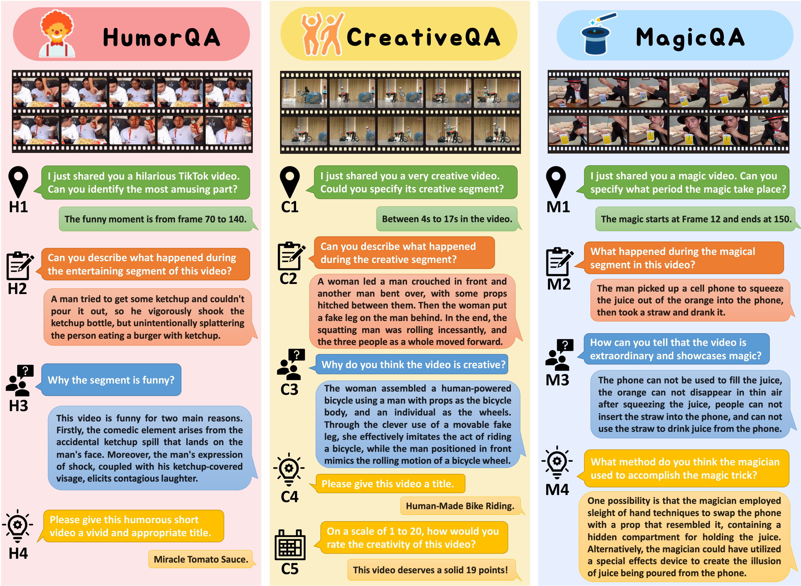
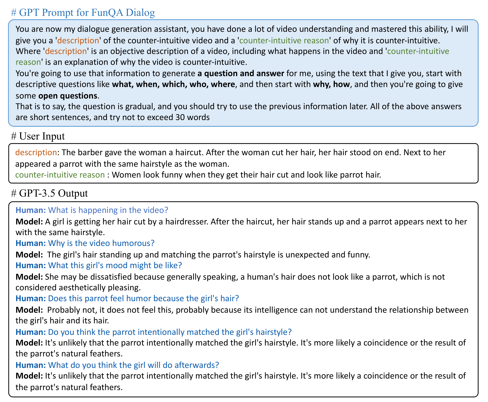

# [FunQA: Towards Surprising Video Comprehension (ECCV 2024)](https://funqa-benchmark.github.io/)


[](https://arxiv.org/abs/2306.14899)
[](https://funqa-benchmark.github.io/)
[](https://huggingface.co/datasets/fesvhtr/FunQA)
[](https://youtu.be/Uh6A4h-Nm78)
[](https://www.bilibili.com/video/BV1Ch411N7bD/?share_source=copy_web&vd_source=dbe610f9a7910f3eae7ae2bf5aa6a8e2)
</br>


https://github.com/Jingkang50/FunQA/assets/17070708/2a03eb8b-dd2a-4eaf-b2a4-fcd36c56b54a

<video controls>
  <source src="[https://github.com/Jingkang50/FunQA/assets/17070708/2a03eb8b-dd2a-4eaf-b2a4-fcd36c56b54a](https://github.com/Jingkang50/FunQA/assets/17070708/2a03eb8b-dd2a-4eaf-b2a4-fcd36c56b54a)" type="video/mp4">
Your browser does not support the video tag.
</video>

Welcome to FunQA's Codebase Repository!

```
This repo provides the code for evaluating your model's output (json file).
```

## Introducing FunQA
The motivation for the FunQA is straightforward: Humans enjoy surprising videos, including funny clips, creative performances, or visual illusions. We aim to evaluate and empower AI models with similar capabilities.

FunQA is a VideoQA dataset to evaluate and enhance the model's video reasoning capability upon counter-intuitive videos, including humorous and funny viral videos from [TikTok](https://www.tiktok.com/@funnyvideosvf?is_from_webapp=1&sender_device=pc), creative performance from [Kasou Taishou (欽ちゃん＆香取慎吾の全日本仮装大賞)](https://en.wikipedia.org/wiki/Kasou_Taishou), and magic videos from [YouTube](https://www.youtube.com/playlist?list=PLnlST2lBA34vHH_8rNvTFYvJ7e5IT0pHm) and [TikTok](https://www.tiktok.com/@magicsingh?is_from_webapp=1&sender_device=pc).

We establish rigorous QA tasks designed to assess the model's capability in counter-intuitive timestamp localization, detailed video description, and reasoning around counter-intuitiveness. We also pose higher-level tasks, such as attributing a fitting and vivid title to the video, and scoring the video creativity.

In total, the FunQA benchmark consists of 312K free-text QA pairs derived from 4.3K video clips, spanning a total of 24 video hours.
Extensive experiments with existing VideoQA models reveal significant performance gaps for the FunQA videos across spatial-temporal reasoning, visual-centered reasoning, and free-text generation.

## Updates
- **16 June, 2023**: :boom::boom: The [FunQA challenge](https://iacc.pazhoulab-huangpu.com/contestdetail?id=64af50154a0ed647faca623a&award=1,000,000) with $1M prize starts! At the same time, we released the evaluation code.


## Todo

1. [x] Release the FunQA dataset and arXiv paper.
2. [x] Release evaluation code.
3. [ ] Release the FunQA Extended dataset.

## Table of Contents

- [1. FunQA Benchmark](#1---funqa-benchmark)
    * [1.1 FunQA Main Tasks](#11---funqa-main-tasks)
    * [1.2 FunQA Extended Dataset](#12---funqa-extended-tasks)
- [2. Data Preparation](#2---data-preparation)
- [3. Acknowledgement](#acknowledgement)
- [4. License](#license)

## 1 - FunQA Benchmark

### 1.1 - FunQA Main Tasks
FunQA comprises three subsets of surprising videos: 1) HumorQA, 2) CreativeQA, and 3) MagicQA. Each subset is associated with three common tasks: 1) counter-intuitive timestamp localization, 2) detailed video description, and 3) reasoning around counter-intuitiveness (see H1-3, C1-3, and M1-3). Furthermore, we offer higher-level tasks tailored for each video type, such as attributing a fitting and vivid title for HumorQA and CreativeQA (see H4, C4), etc.


### 1.2 - FunQA Extended Tasks

#### FunQA Multi-choice Dataset
FunQA Multi-choice Dataset is prepared to provide training and testing for arbitrary models, in this dataset our QA pairs are in the form of multiple choice, the answer is a word, phrase, or short sentence, and the type of questions are all descriptions.


#### FunQA Dialog Dataset

Most of the current LLMs are in the form of dialogues. To cater to their data input, we produced the FunQA Dialog dataset, in which we used GPT-3.5 to convert QA pairs into recursive dialogues with added context.



## 2 - Data Preparation

Please download all the videos and annotation files from [here](https://huggingface.co/datasets/fesvhtr/FunQA).

For FunQA Dataset: there are four zip files:

- `train.zip`, `val.zip`, `test.zip`: Videos for training, validation and test.
- `FunQA_train.json`, `FunQA_val.json`, `FunQA_test.json`: Annotation files for FunQA Base Dataset.

For FunQA Multi-choice Dataset:  
- `Funqa_mcqa_v1.json`: Annotation files for FunQA-MC Dataset.

## 3 - Evaluation
```
cd FunQA
conda create -n funqa python=3.10

# install bleurt
git clone https://github.com/google-research/bleurt.git
cd bleurt
pip install .


# download recommended checkpoint for bleurt

wget https://storage.googleapis.com/bleurt-oss-21/BLEURT-20.zip .
unzip BLEURT-20.zip

pip install -r requirements.txt
conda activate funqa
```

Please move archive bleurt/bleurt to bleurt/
Then edit and run ./scripts/run_classic_eval.sh and ./scripts/run_gpt4_eval.sh for evalution.
## Acknowledgement

This study is supported by the Ministry of Education, Singapore, under its MOE AcRF Tier 2 (MOE-T2EP20221- 0012), NTU
NAP, and under the RIE2020 Industry Alignment Fund – Industry Collaboration Projects (IAF-ICP) Funding Initiative, as
well as cash and in-kind contribution from the industry partner(s).

If you're using FunQA in your research or applications, please cite using this BibTeX:
```bibtex
  @inproceedings{xie2024funqa,
    author={Binzhu Xie and Sicheng Zhang and Zitang Zhou and Bo Li and Yuanhan Zhang and Jack Hessel and Jingkang Yang and Ziwei Liu},
        year={2024},
    title={FunQA: Towards Surprising Video Comprehension},
    booktitle = {European Conference on Computer Vision (ECCV)},
    year = {2024},
    url={https://www.ecva.net/papers/eccv_2024/papers_ECCV/papers/00010.pdf}, 
}
```

## License
<a rel="license" href="http://creativecommons.org/licenses/by-nc-sa/4.0/"></a><br />This work is licensed under a <a rel="license" href="http://creativecommons.org/licenses/by-nc-sa/4.0/">Creative Commons Attribution-NonCommercial-ShareAlike 4.0 International License</a>.


Looking forward to your feedback and please raise any issues or questions [here](https://github.com/Jingkang50/FunQA/issues).
